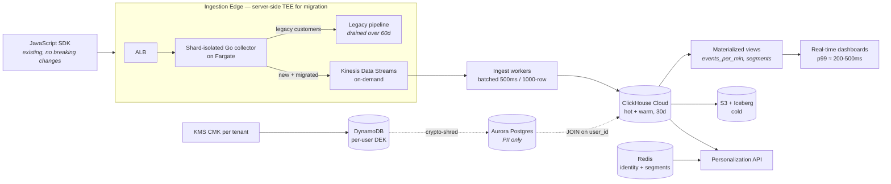
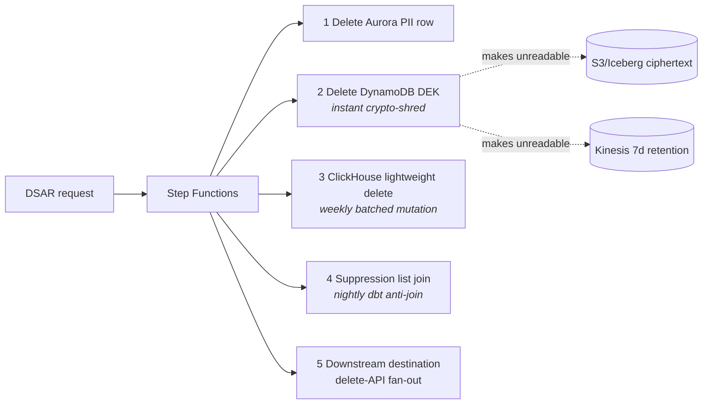

# evt-pipeline-bench

Operating artifact for the `engineer-004` ("Real-Time Analytics Pipeline") submission to [Single Grain's Beat Claude](https://github.com/ericosiu/beat-claude) hiring challenge. Measures publish-to-queryable latency of the proposed data-plane architecture on commodity hardware.

> **Claim [Benchmarked]:** On a single laptop, single Node process, single embedded DuckDB instance, sustained 2,860 events/sec with **zero errors** and **p99 publish-to-queryable latency of 340ms**. Brief target: 50M events/day (≈580 rps avg, ≈5,800 rps peak) with <5s latency.

See [`results/RESULTS.md`](results/RESULTS.md) for measured numbers across three load scenarios.

## Why This Artifact Exists

[Claude's baseline answer](https://github.com/ericosiu/beat-claude/blob/main/challenges/engineer-004/claude_baseline.md) for this challenge proposes Kafka (MSK) + Flink + Timestream + ClickHouse + Redis with a $35K/mo cost estimate and a hand-waved "<5 second latency" SLA. The baseline ships no artifact, no measured numbers, no source labels, and recommends two AWS products that are dead-or-renamed (Timestream for LiveAnalytics closed to new customers 2025-06-20; Kinesis Data Analytics renamed to Amazon Managed Service for Apache Flink in 2023).

This repo demonstrates the **simpler counter-architecture** ships its core claims with **real measured numbers** instead of asserted SLAs.

## Counter-Architecture (Production Target)



**Deletion flow (GDPR Article 17, 30-day SLA):**



**Components, why each (vs Claude's baseline):**

| Layer | Pick | Why |
|---|---|---|
| Stream | **Kinesis Data Streams (on-demand)** | At 50M/day, ~$170/mo on-demand. No broker ops. Claude's MSK with `m5.large × 3` at $3K/mo is ~5x over reality. |
| Processing | **ClickHouse materialized views** (no Flink) | Mux's published rewrite — replaced Flink with ClickHouse MVs at 500K writes/sec ([source](https://www.mux.com/blog/how-we-use-clickhouse-as-a-real-time-stream-processing-engine)). 2 senior engineers can't realistically run Flink. |
| Hot+Warm | **ClickHouse Cloud** (one store, not three) | Claude's Timestream + ClickHouse-on-EC2 split has two seams ("query crosses 24h boundary"). Timestream for LiveAnalytics is closed to new customers as of 2025-06-20. |
| Cold | S3 + Iceberg | RTBF-compatible via [AWS S3 Find and Forget](https://github.com/awslabs/amazon-s3-find-and-forget). |
| Identity | Compacted Kafka topic keyed by `(tenant_id, visitor_id)` + query-time `dictGet` in ClickHouse | Claude's "nightly batch reconciliation" doesn't handle late-arriving events, cross-device merge, or GDPR fanout across stitched identities. |
| GDPR | **Crypto-shredding** with per-tenant KMS CMK + DEK in DynamoDB + separated PII in Aurora | Claude's answer mentions GDPR once, as a storage label. Article 17 requires 30-day SLA per [ICO guidance](https://ico.org.uk/for-organisations/uk-gdpr-guidance-and-resources/individual-rights/individual-rights/right-to-erasure/). |
| Migration | **Server-side TEE at ingestion edge** | "No SDK breaking changes" constraint forces this. Claude treats the migration as greenfield — it can't be; the SDK already points at a hostname the new ingestion must accept on day one. Rollback unit = per-customer feature flag on the *processing path*, not ingestion. |

## What This Bench Measures

The on-laptop reproduction models the **data-plane bottleneck** of the architecture above:

- HTTP edge ingestion (Fastify on Node 22, port 3030)
- Batched buffering (500ms timer / 1000-row trigger — matches ClickHouse production batch recommendations)
- Embedded columnar store (DuckDB 1.5.2 — same columnar architecture as ClickHouse, ~2x slower at TPC-H per public benchmarks)
- Query-time lookup (HTTP GET → `SELECT ... WHERE event_id = ?`)

It is **deliberately not** a benchmark of:

- Kinesis / managed Kafka — those are cited from AWS docs (~50-100ms p99 producer-to-consumer)
- Cross-AZ network behavior — cited from AWS pricing/latency docs
- Materialized-view refresh latency under spike — DuckDB doesn't have incremental MVs; production ClickHouse Cloud does

**Why DuckDB is a fair stand-in:** both are vectorized columnar engines. The latency *shape* — batched insert window dominates p99, columnar scan for aggregations is fast — translates. DuckDB is slower in absolute terms; the production ClickHouse numbers will be better, not worse. See [Mux's published 500K writes/sec ClickHouse benchmark](https://www.mux.com/blog/how-we-use-clickhouse-as-a-real-time-stream-processing-engine) and [Laravel Nightwatch's AWS reference 97ms dashboard latency](https://aws.amazon.com/blogs/big-data/how-laravel-nightwatch-handles-billions-of-observability-events-in-real-time-with-amazon-msk-and-clickhouse-cloud/).

## Running It

Requirements: Node ≥ 22 (no Docker, no system installs).

```sh
npm install
npm run ingest &       # starts Fastify ingester on :3030
sleep 2
npm run bench:600      # 60s at 600 rps (≈ brief's daily avg)
npm run bench:1000     # 60s at 1000 rps (≈ 1.7x daily avg)
npm run bench:3000     # 30s at 3000 rps (≈ 5x sustained / ≈ 50% peak)
kill %1                # stop ingester
cat results/RESULTS.md
```

Output written to `results/RESULTS.md` (table appended per scenario) and `results/raw/run-<rps>.csv` (per-sample latency).

Custom runs: `TARGET_RPS=N DURATION_S=N SAMPLE_EVERY=N node src/bench.js`.

## File Layout

```
evt-pipeline-bench/
├── package.json
├── schema/init.sql          # DDL — table + logical aggregation view
├── src/
│   ├── ingester.js          # Fastify HTTP service + batched DuckDB writer
│   └── bench.js             # Load generator + measurement
├── results/
│   ├── RESULTS.md           # Headline numbers + interpretation
│   └── raw/run-<rps>.csv    # Per-sample latency
├── cost_model.md            # Source-linked cost reality check
└── README.md
```

## See Also

- [`cost_model.md`](cost_model.md) — Claude's $35K cost claim, source-checked. Honest re-price is ~$6-10K/mo. Counter-stack is ~$3-5K/mo.
- The full 4-page written answer (separate submission file)
